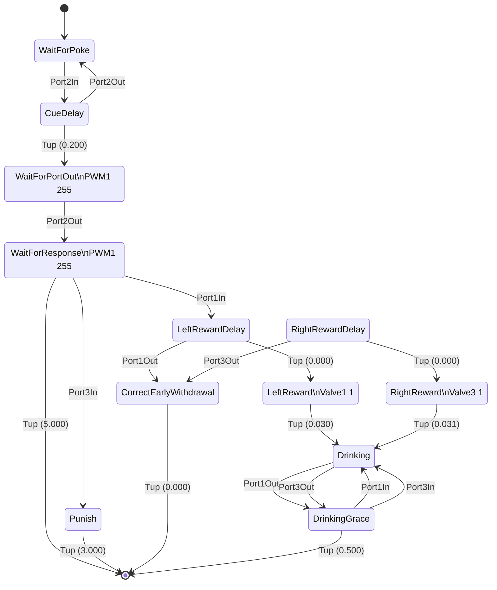

# Bpod-SMA-Diagrammer
This repository contains `sma_diagram.m` which allows Bpod users to build state diagrams using Mermaid, making it easy to visualise and share information about trial structure.

[Bpod](https://github.com/sanworks/Bpod_Gen2) is an open source tool for rodent behaviour. MATLAB is used to interface with a state machine, and a series of functions are used to generate `sma`, a state matrix that is sent to the state machine. Diagrams of the protocol are often produced by hand by looking at the MATLAB code used to create `sma`, but with `sma_diagram` a schematic of the state matrix can be reconstructed exactly using `sma` itself.

## Usage
To install and use, `sma_diagram.m` has to be on the MATLAB Path to be used. You could add the folder to the Path, or copy/paste the file into the MATLAB folder.

```matlab
sma = NewStateMachine()
% ... [Your code using AddState() to build a state machine] ...

[mermaid_text, sma_struct] = sma_diagram(sma);
% this also prints the mermaid diagram into console by default

```

Check `sma_diagram.m` for optional parameters (e.g. `sma_diagram(sma, 'display', false)`).

`sma_struct` is a human-readable structure of the state matrix, which you may find useful to insert into `BpodSystem.Data` so that `SessionData` contains the matrix for later reference (if your protocol tends to undergo changes).

## A brief word on Mermaid and why we should use it
[Mermaid](https://mermaid.js.org/intro/) is a "charting tool that renders Markdown-inspired text definitions to create and modify diagrams dynamically". The reason for its usefulness in the Bpod context is that it's wise to store a `readme.md` within each Bpod protocol folder for documentation purposes, and having a schematic of the trial structure can be a useful way of sharing information about how it works. Mermaid features a [live editor web tool](https://mermaid.live/) that makes it easy to modify the diagram on the fly.

## Example of usage
I added `sma_diagram(sma)` into Bpod's example protocol [`Examples/Protocols/Light/Light2AFC`](https://github.com/sanworks/Bpod_Gen2/blob/master/Examples/Protocols/Operant/Operant.m) (after `sma` construction Line 119 in the protocol). The first trial happened to be trial type 1, and the raw output (that I copied from MATLAB's Command Window) embedded in markdown looks like this:


The first few lines of text used to build this diagram (that I copy/pasted into this Markdown file) looks like this:

```
stateDiagram-v2
WaitForPoke: WaitForPoke
	[*] --> WaitForPoke
	WaitForPoke --> CueDelay: Port2In
CueDelay: CueDelay
	CueDelay --> WaitForPortOut: Tup (0.200) 
	CueDelay --> WaitForPoke: Port2Out
WaitForPortOut: WaitForPortOut\nPWM1 255
	WaitForPortOut --> WaitForResponse: Port2Out
WaitForResponse: WaitForResponse\nPWM1 255
	WaitForResponse --> [*]: Tup (5.000) 
	WaitForResponse --> LeftRewardDelay: Port1In
	WaitForResponse --> Punish: Port3In
```


Mermaid is rendered by GitHub (and any editor that supports Mermaid) when presented in Markdown files. This is the raw output from my tool, built from a single trial's state matrix. With some small tweaks, it can represent the entire task with its different contingencies more generally. To do that, you'll have to refer to the [documentation on state diagrams](https://mermaid.js.org/syntax/stateDiagram.html). For example, in the above diagram I'd modify the transitions from `WaitForResponse` so that there is a line with `Port3In` to `RightRewardDelay`, and the connection to `Punish` could read "`Port1In or Port3In`". There are other visual tools available for the state diagram that you might like to look into if you have complex contingencies.