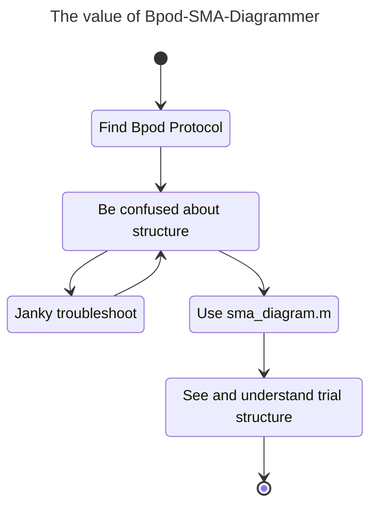
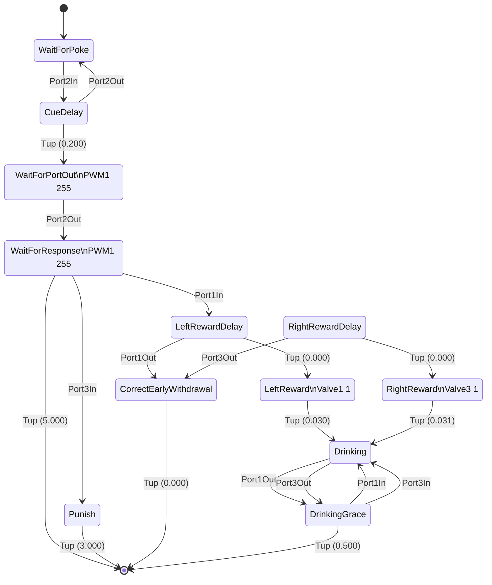

# Bpod-SMA-Diagrammer
This repository contains `sma_diagram.m` which allows Bpod users to build state diagrams using Mermaid, making it easy to visualise and share information about trial structure.

[Bpod](https://github.com/sanworks/Bpod_Gen2) is an open source tool for rodent behaviour. MATLAB is used to interface with a state machine, and a series of functions are used to generate `sma`, a state matrix that is sent to the state machine. Diagrams of the protocol are often produced by hand by looking at the MATLAB code used to create `sma`, but with `sma_diagram` a schematic of the state matrix can be reconstructed exactly using `sma` itself.



## Usage
To install, `sma_diagram.m` has to be on the MATLAB Path to be used. You could add this folder to the Path, or copy/paste `sma_diagram.m` into the MATLAB folder.

To use, you must feed `sma_diagram()` your `sma`:

```matlab
sma = NewStateMachine()
% ... [Your code using AddState() to build a state machine] ...

[mermaid_text, sma_struct] = sma_diagram(sma);

```

Check `sma_diagram.m` for optional parameters (e.g. `sma_diagram(sma, 'display', false)`).

`mermaid_text` is the Mermaid code used to create the state diagram.

`sma_struct` is a human-readable structure of the state matrix, which you may find useful to insert into `BpodSystem.Data` so that `SessionData` contains the matrix for later reference (if your protocol tends to undergo changes).

## A brief word on Mermaid and why we should use it
[Mermaid](https://mermaid.js.org/intro/) is a "charting tool that renders Markdown-inspired text definitions to create and modify diagrams dynamically". Github, and many Markdown editors, can render diagrams using only Mermaid code in the Markdown file. It's a lightweight and portable way of sharing the schematic across systems. You do not need to know how to write or modify Mermaid code to use this tool, but you do need to be able to put it into a markdown file so that it is read and rendered properly.

Mermaid diagrams are rendered from simple plain text that follows certain rules. Just as Markdown parses "`[Bpod](https://github.com/sanworks/Bpod_Gen2)`" to be rendered as "[Bpod](https://github.com/sanworks/Bpod_Gen2)", Mermaid will be used to read a code block containing Mermaid code with the `mermaid` descriptor. I think the best explanation is to look at [the raw markdown for the this file](https://github.com/ogeesan/Bpod-SMA-Diagrammer/blob/main/README.md?plain=1) and see how what appears as a diagram in the final render is in fact just Mermaid code, but with '`mermaid`' written after the start of a code block. There is a Mermaid [live editor web tool](https://mermaid.live/) that makes it easy to modify the diagram on the fly, and to get a feel for what Mermaid is (look at the Examples on that website).

The reason for its usefulness in the Bpod context is that it's wise to store a `readme.md` within each Bpod protocol folder for documentation purposes, and having a schematic of the trial structure can be a useful way of sharing information about how it works. Mermaid probably has broader application in scientific documentation outside of Bpod too.

The other reason to use Mermaid, and certainly why I chose to use it, is that it passes off all of the complexities of visual diagrams off to a 3rd party because making it manually ourselves would be a bit of a pain. Mermaid isn't exactly pretty, but it's very functional and quick to modify if needed.

## Example of usage
I added `sma_diagram(sma)` into Bpod's example protocol [`Examples/Protocols/Light/Light2AFC`](https://github.com/sanworks/Bpod_Gen2/blob/master/Examples/Protocols/Light/Light2AFC/Light2AFC.m) (after `sma` construction Line 119 in the protocol). The first trial happened to be trial type 1, and the raw output (that I copied from MATLAB's Command Window) embedded in markdown looks like this:


To reiterate the points from before, the diagram you see above is just plain text in this Markdown file but Github is recognising it as Mermaid and constructing the diagram. The first few lines of text used to build this diagram (that I copy/pasted into this Markdown file) looks like this:

```
stateDiagram-v2
WaitForPoke: WaitForPoke
	[*] --> WaitForPoke
	WaitForPoke --> CueDelay: Port2In
CueDelay: CueDelay
	CueDelay --> WaitForPortOut: Tup (0.200) 
	CueDelay --> WaitForPoke: Port2Out
WaitForPortOut: WaitForPortOut\nPWM1 255
	WaitForPortOut --> WaitForResponse: Port2Out
WaitForResponse: WaitForResponse\nPWM1 255
	WaitForResponse --> [*]: Tup (5.000) 
	WaitForResponse --> LeftRewardDelay: Port1In
	WaitForResponse --> Punish: Port3In
```

With some small tweaks, this single trial's state matrix can be modified to represent the entire task with its different contingencies more generally. To do that, you'll have to refer to the [documentation on state diagrams](https://mermaid.js.org/syntax/stateDiagram.html). For example, in the above diagram I'd modify the transitions from `WaitForResponse` so that there is a line with `Port3In` to `RightRewardDelay` (`WaitForResonse --> RightRewardDelay: Port3In`), and the connection to `Punish` could read "`Port1In or Port3In`". There are other visual tools available for the state diagram that you might like to look into if you have complex contingencies.
