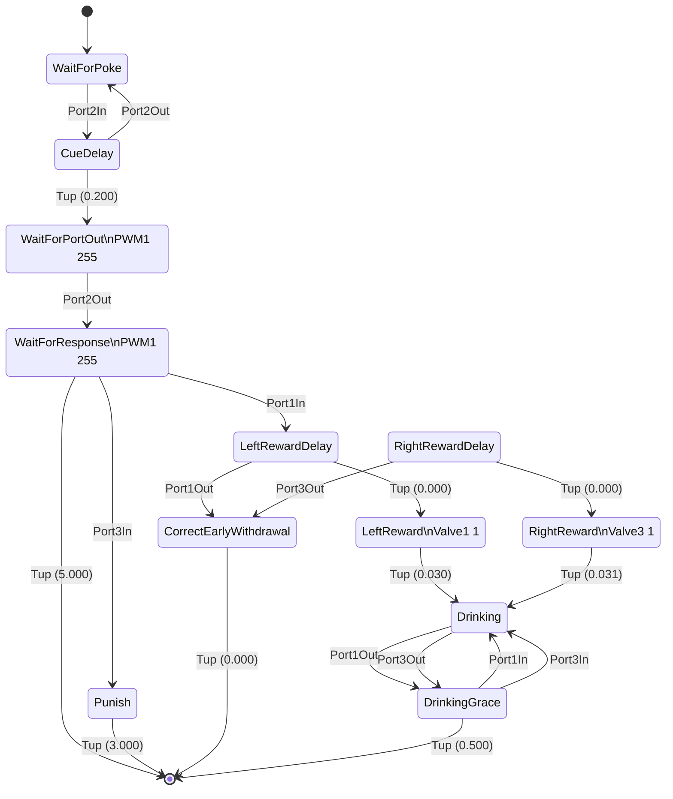

# Bpod-SMA-Diagrammer
This repository allows Bpod users to build state diagrams using Mermaid.

What's this tool for? It's primary purpose is to visualise the state matricies. In this regard, it's useful for troubleshooting/developing a protocol, as well as the documentation and sharing of information about the trial structures.

## Usage
```matlab
sma = NewStateMachine()
% ... [Your code using AddState() to build a state machine] ...

[mermaid_text, sma_struct] = sma_diagram(sma);

```

## A brief word on Mermaid
[Mermaid](https://mermaid.js.org/intro/) is a "charting tool that renders Markdown-inspired text definitions to create and modify diagrams dynamically". The reason for its usefulness in the Bpod context is that it's wise to store a `readme.md` within each Bpod protocol file for documentation purposes, and having a schematic of the trial structure can be a useful way of sharing information about how it works.

Here's Bpod's [`Examples/Protocols/Light/Light2AFC`](https://github.com/sanworks/Bpod_Gen2/blob/master/Examples/Protocols/Operant/Operant.m) turned into a mermaid diagram.

For trial type 1:


The first few lines of code used to build this diagram look like the following:

```
stateDiagram-v2
WaitForPoke: WaitForPoke
	[*] --> WaitForPoke
	WaitForPoke --> CueDelay: Port2In
CueDelay: CueDelay
	CueDelay --> WaitForPortOut: Tup (0.200) 
	CueDelay --> WaitForPoke: Port2Out
WaitForPortOut: WaitForPortOut\nPWM1 255
	WaitForPortOut --> WaitForResponse: Port2Out
WaitForResponse: WaitForResponse\nPWM1 255
	WaitForResponse --> [*]: Tup (5.000) 
	WaitForResponse --> LeftRewardDelay: Port1In
	WaitForResponse --> Punish: Port3In
```

Mermaid is rendered by GitHub when presented in Markdown files. This is the raw output from my tool, built from a single trials' state matrix. With some small tweaks, it can easily represent the entire task with its different contingencies more generally.